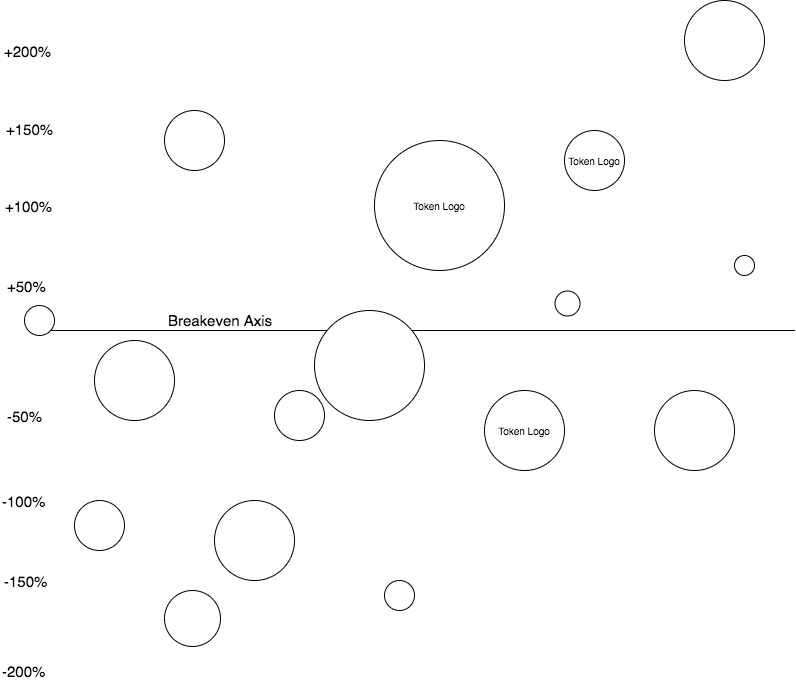

# Initial Coin Offering Bubble Chart

### Background

An initial coin offering or ICO has rapidly become a way to raise money for a particular project using cryptocurrency via a blockchain. The crowdfunding manner of ICOs has recently overtaken the capital raised from tradition venture capital backing in the space.

Persons participating in an ICO are rewarded with tokens which work similar to paid API keys for that particular platform. Platforms or 'fat protocols' have a wide range of technology that they are trying to implement from prediction markets to decentralized file storage.

Withstanding criticism, this new form of raising capital is picking up steam. By increasing the buyer base and time to liquidity these tokens are allowing for more projects to hit the ground running that have not been possible in the past.

### Functionality & MVP

  With this Token ICO Bubble chart, users will be able to:

- [ ] Visualize the tokens populating the chart with animation when arriving at the site
- [ ] Hover over any bubble to get a more detailed description of their ICO
- [ ] Filters for cluster separation for ERC20 tokens separated from others
- [ ] Animation to show a X-axis to represent breakeven with bubbles plotted against the Y-axis up or down for percent gains or losses since initial offering  
- [ ] Each token will have external links to the company website or whitepaper

In addition, this project will include:

- [ ] Production Readme with images, a live demo link and more detail of the implementation

### Wireframes

The splash page for this single page app will display the token bubbles solely containing their corresponding logo. The X-axis will have dates in year intervals starting 2014 to indicate when each ICO for the token was initially released. A button will allow the user to filter for Ethereum token ICOs or all token ICOs.

When a bubble is hovered over a popup is opened to show more detailed information regarding that particular token.

When the ROI button is clicked the profit/loss chart from initial offering is rendered.

### Architecture & Technologies

  This project will implement the following technologies:  

  JavaScript and AJAX to pull from external API and plot gains or losses per token,
  HTML5 and SVG to structure and render the interactive chart,
  D3v4 to merge all visualization and interaction to the DOM,
      - d3-force to assist with transitions
      - d3-scale to proportion the bubble sizes

### Implementation Timeline

Day 1 (Saturday): Research best way to visualize data and how to implement it. Create wireframes. Initialize repository on Github and create skeleton file structure. Parse token logos and token detail information into proper formats.

Day 2 (Sunday): Read through D3v4 materials and decide if any additional modules are needed. Add logos to `csv` file with token information with a column to its local path. Conceptualize general CSS color scheme.

Day 3 (Monday):Setup all necessary Node modules including D3v4 and d3 force module. Ensure proper setup of `webpack` along with creating `webpack.config.js` and `package.json` files. Configure entry file with all necessary scripts.

Day 4 (Tuesday): Implement the Coin Market Cap API. Get all bubbles to render correctly with scaled sizes depending on USD raised at offering. Import background images of the logos in scale to each bubble.

Day 5 (Wednesday): Create proper force simulation to ensure animation triggers when: first arriving at site and when clicking any filter button. Upload all logos to Cloudinary.

Day 6 (Thursday): Add CSS style to navigation bar, bubble text detail and any surrounding areas that will enhance the visual experience.

### Bonus Features

  This application could add many more useful features in the future. Some anticipated updates are:

- [ ] Implement an external API to bring in real time ROI
- [ ] Add real-time currency conversion for more then USD
- [ ] Add filter to show 24 hour volume circulation
